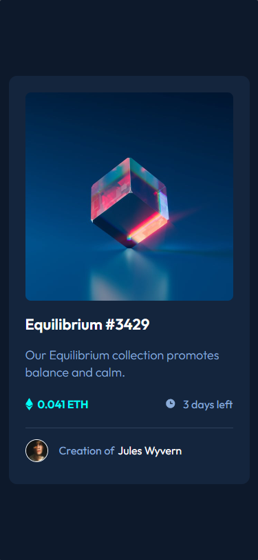

# Frontend Mentor - NFT preview card component solution

This is a solution to the [NFT preview card component challenge on Frontend Mentor](https://www.frontendmentor.io/challenges/nft-preview-card-component-SbdUL_w0U). 

## Table of contents

- [Overview](#overview)
  - [Screenshot](#screenshot)
  - [Links](#links)
- [My process](#my-process)
  - [Built with](#built-with)
- [Author](#author)

## Overview

### Screenshot

### Links

- Solution URL: [Add solution URL here](#)
- Live Site URL: [Add live site URL here](#)

## My process

### Built with 

- Semantic HTML5 markup
- CSS custom properties

## Author 

- Frontend Mentor - [@ilnaraackermann](https://www.frontendmentor.io/profile/IlnaraAckermann)
- LinkdIn - [@ilnaraackermann](https://www.linkedin.com/in/ilnaraackermann)

